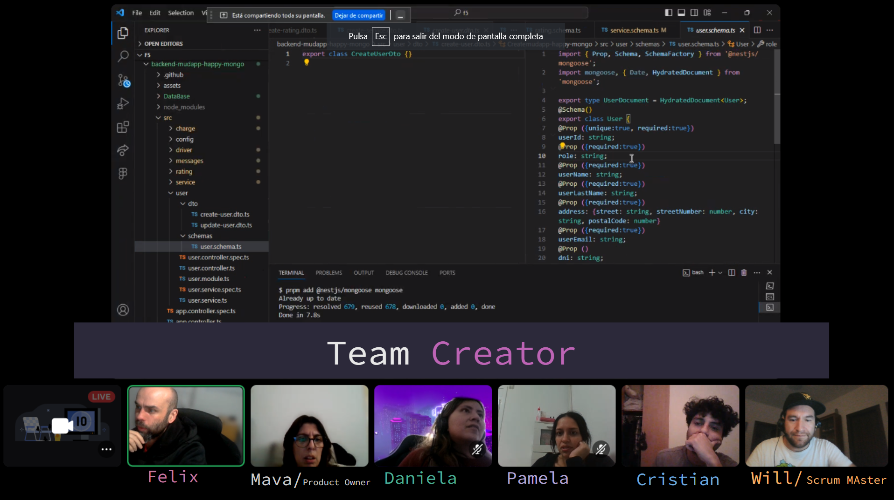

# HappyMongo


## Introduction

Welcome to the repository of the web application designed to streamline the world of moving and parcel transportation. This initiative aims to connect people with the need for goods transportation to carriers with vehicles suitable for those needs, drawing inspiration from the successful UBER model.

This app has been developed as an assignment for the Factoria F5 Bootcamp, January-February 2024.

<p align="center">
  <a href="http://nestjs.com/" target="blank"></a>
</p>

Congratulations team! So far, we have made significant progress in developing the web application and have successfully established the database. In this phase, we will focus on the backend development of the application.

## Team Creator

- [Felix](https://github.com/FelixRodriguezG) 
- [Mava](https://github.com/mavafiza)
- [Dani](https://github.com/RuthDanielaAguirre)
- [Pame](https://github.com/pamelab182)
- [Cris](https://github.com/ctupac999)
- [Will](https://github.com/wilpipe)


## Technical Requirements

To ensure the quality and efficiency of our application, we have established the following technical requirements:

1. **Linting:**
   - Linting has been implemented to maintain consistent and high-quality code.

2. **Testing:**
   - Unit testing and integration testing have been conducted for all application endpoints.

3. **Documentation:**
   - API documentation has been created using OpenAPI (Swagger) to facilitate understanding and usage.

4. **Deployment in Production:**
   - The application has been successfully deployed in a production environment.


## Deliverables

The required deliverables are detailed below:

1. **GitHub Repository:**
   - [Link to Repository](https://github.com/projects-assignments/backend-mudapp-happy-mongo)

2. **Readme:**
   - [Index](#index)
   - [Repository Contents](#repository-contents)
   - [Technologies Used](#technologies-used)
   - [Resource Links](#resource-links)

3. **Logical Database Model:**
   - The logical database model is attached in a file.

4. **Database Dump File:**
   - A database dump file is provided to facilitate environment replication.

5. **Installation Instructions:**
   - Detailed instructions on how to install and run the application.

6. **Presentation**
   - [Link to Presentation](./assets/Introduction%20to%20HappyMongo.pdf)

## Index

1. [Introduction](#introduction)
2. [Technical Requirements](#technical-requirements)
3. [Pedagogical Modality](#pedagogical-modality)
4. [Deliverables](#deliverables)
5. [Index](#index)

## Repository Contents

- **/backend:** Contains the source code of the backend of the application.
- **/docs:** API documentation generated with Swagger.
- **/database:** Contains the logical database model and the dump file.
- **/presentation:** Files related to the presentation.

## Technologies Used

                  


## Resource Links

- [Presentation](./assets/Introduction%20to%20HappyMongo.pdf)

Thank you for visiting our repository! We are excited to share the progress of our project. If you have any questions or suggestions, feel free to contact us. We hope you find our application useful!

---
<!-- <p align="center">
  <a href="http://nestjs.com/" target="blank"></a>
</p> -->

----

## Installation

```bash
$ pnpm add -g @nestjs/cli #optional
$ pnpm install
$ pnpm add @nestjs/mongoose mongoose
$ pnpm add @nestjs/jwt
$ pnpm add --save-dev @types/bcrypt
$ pnpm add --save-dev @types/passport-local
```

## Running the app

```bash
# development
$ pnpm run start

# watch mode
$ pnpm run start:dev

# production mode
$ pnpm run start:prod
```

## Test

```bash
# unit tests
$ pnpm run test

# e2e tests
$ pnpm run test:e2e

# test coverage
$ pnpm run test:cov
```

